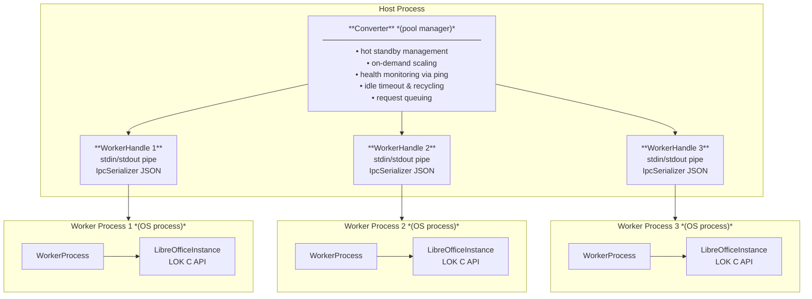

# LibreOfficeKit

A .NET 10 library and console application for document-to-PDF conversion using LibreOfficeKit, featuring a multi-process
worker pool for safe concurrent conversions.

## Architecture

LibreOfficeKit (LOK) is **not** thread-safe — only one instance per process is allowed. To enable concurrent
conversions, this project uses a **process pool** architecture:



## Solution Structure

| Project                  | Type          | Description                                                      |
|--------------------------|---------------|------------------------------------------------------------------|
| `LibreOfficeKit`         | Class Library | Core library: Converter, WorkerProcess, IPC, LOK bindings, Enums |
| `LibreOfficeKit.Console` | Console App   | Demo/testing console application                                 |

## Key Components

### `LibreOfficeKit` (Class Library)

| File                            | Description                                                      |
|---------------------------------|------------------------------------------------------------------|
| `Converter.cs`                  | Main pool manager — spawns, monitors, and recycles workers       |
| `WorkerHandle.cs`               | Encapsulates state and IPC for a single worker process           |
| `WorkerProcess.cs`              | Worker mode entry point — runs in spawned processes              |
| `LibreOfficeInstance.cs`        | Low-level LOK wrapper — initialization and document loading      |
| `LoDocument.cs`                 | Document wrapper — save/convert and type queries                 |
| `LibreOfficeKitBindings.cs`     | P/Invoke bindings for the native LOK C API                       |

#### `Protocols/`

| File                            | Description                                                      |
|---------------------------------|------------------------------------------------------------------|
| `IpcProtocol.cs`                | IPC message type definitions                                     |
| `IpcSerializer.cs`              | JSON serialization for IPC messages                              |
| `PingRequest.cs`                | Health-check ping request message                                |
| `PongResponse.cs`               | Health-check pong response message                               |
| `WorkerRequest.cs`              | Conversion request message sent to a worker                      |
| `WorkerResponse.cs`             | Base worker response message                                     |
| `ConvertResponse.cs`            | Successful conversion response message                           |
| `ReadyResponse.cs`              | Worker ready/idle status response message                        |
| `ErrorResponse.cs`              | Error response message from a worker                             |
| `ShutdownRequest.cs`            | Graceful shutdown request message                                |

#### `Enums/`

| File                            | Description                                                      |
|---------------------------------|------------------------------------------------------------------|
| `DocumentType.cs`               | Document type classification                                     |
| `InitialView.cs`                | PDF initial view mode options                                    |
| `PdfACompliance.cs`             | PDF/A compliance level options                                   |
| `PdfChangePermission.cs`        | PDF change permission flags                                      |
| `PdfCompressionOptions.cs`      | PDF image compression options                                    |
| `PdfOptions.cs`                 | Aggregate PDF export options                                     |
| `PdfPrintPermission.cs`         | PDF print permission flags                                       |
| `PdfSecurityOptions.cs`         | PDF encryption and security options                              |
| `PdfVersion.cs`                 | PDF version/standard selection                                   |
| `SaveFormat.cs`                 | Output save format enumeration                                   |

### `LibreOfficeKit.Console` (Console App)

| File          | Description                             |
|---------------|-----------------------------------------|
| `Program.cs`  | Demo/testing console application entry  |

## Features

- **Hot standby**: Pre-spawned workers for immediate conversion
- **On-demand scaling**: Scale up to `maxInstances` as needed
- **Idle timeout**: Excess workers shut down after idle period
- **Health monitoring**: Background pings detect crashed/hung workers
- **Request queuing**: Requests queue when all workers are busy
- **Stream support**: Convert from/to streams (uses temp files internally)
- **PDF options**: Full control over PDF export quality, compliance, security
- **Enum-based API**: Type-safe save formats and document types
- **Proper disposal**: `IDisposable` and `IAsyncDisposable` for clean shutdown

## Usage

### As a library

```csharp
using LibreOfficeKit;

await using var converter = new Converter(
    maxInstances: 4,
    minHotStandby: 2,
    idleTimeout: TimeSpan.FromMinutes(5));

await converter.ConvertToPdfAsync("input.docx", "output.pdf");
```

### CLI

```bash
# Pool-based conversion (recommended)
dotnet run --project src/LibreOfficeKit.Console -- input.docx output.pdf

# Direct single-instance conversion
dotnet run --project src/LibreOfficeKit.Console -- --direct input.docx output.pdf
```

## Prerequisites

- [.NET 10 SDK](https://dotnet.microsoft.com/download)
- [LibreOffice](https://www.libreoffice.org/) installed

## Build

```bash
dotnet build LibreOfficeKit.sln
```
